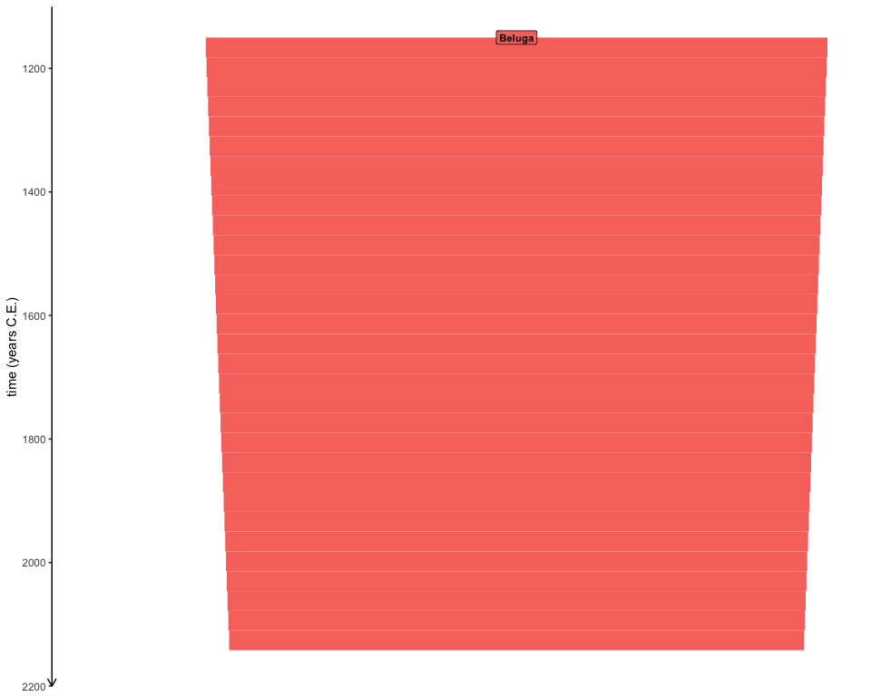
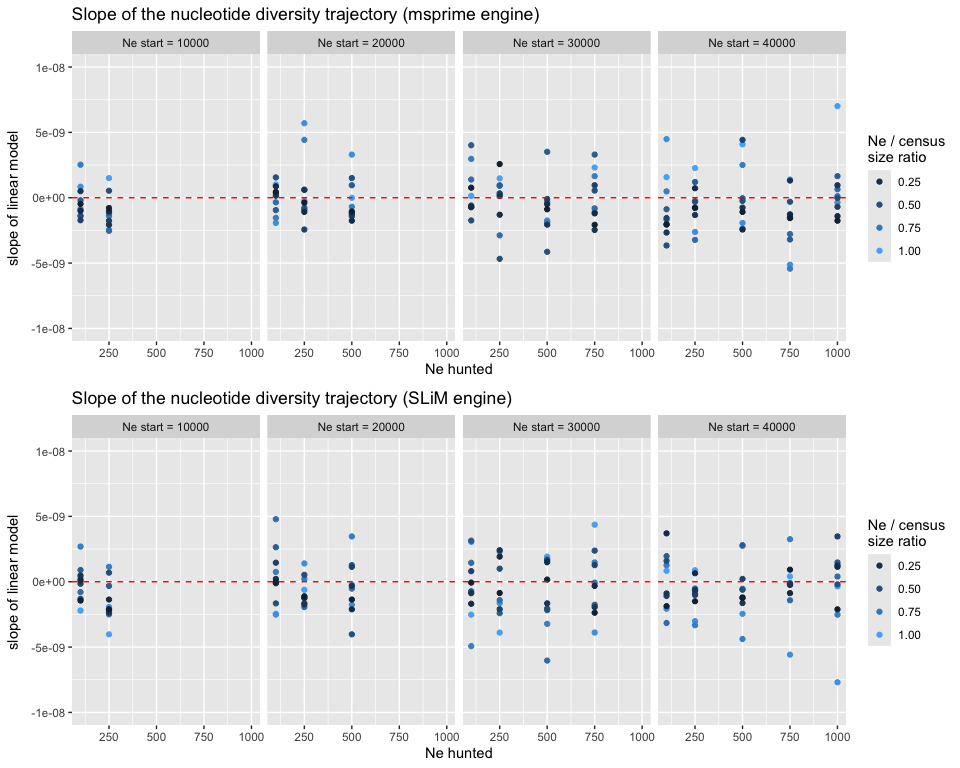

Beluga nucleotide diversity
================
2024-05-30

## Setup

Running this will make sure all dependencies of the project will be
setup before running anything else:

``` r
install.packages("renv")

renv::restore()
```

## Toy simulations of $Ne_e$ vs $\pi$

``` r
library(dplyr)
library(ggplot2)
```

<!-- -->

### Running the simulations

When run, this script will generate the file `pi_simple.rds`:

    Rscript pi_simple.R

### Results

``` r
pi_simple <- readRDS("pi_simple.rds")
```

``` r
pi_simple %>% filter(model == "constant Ne") %>%
  ggplot(aes(factor(Ne), diversity, color = model)) +
  geom_boxplot(position = position_dodge(width = 0.8), outlier.shape = NA) +
  # geom_jitter(position = position_dodge(width = 0.8), alpha = 0.2, size = 0.75) +
  geom_smooth(aes(group = model), method = "lm", linewidth = 0.5, color = "black", linetype = 2) +
  theme(axis.text.x = element_text(hjust = 1, angle = 45), legend.position = "bottom") +
  labs(x = "Ne", y = "nucleotide diversity",
       title = "Expected nucleotide diversity as a function of Ne")
#> `geom_smooth()` using formula = 'y ~ x'
```

<!-- -->

``` r
pi_simple %>% filter(model == "constant Ne" | grepl("100 gens", model)) %>%
  ggplot(aes(factor(Ne), diversity, color = model)) +
  geom_boxplot(position = position_dodge(width = 0.8), outlier.shape = NA) +
  # geom_jitter(position = position_dodge(width = 0.8), alpha = 0.2, size = 0.75) +
  geom_smooth(aes(group = model), method = "lm", linewidth = 0.5, color = "black", linetype = 2) +
  scale_color_discrete(drop = FALSE) +
  theme(axis.text.x = element_text(hjust = 1, angle = 45), legend.position = "bottom") +
  labs(x = "Ne", y = "nucleotide diversity",
       title = "Expected nucleotide diversity as a function of Ne")
#> `geom_smooth()` using formula = 'y ~ x'
```

<!-- -->

``` r
pi_simple %>% filter(model == "constant Ne" | grepl("1000 gens", model)) %>%
  ggplot(aes(factor(Ne), diversity, color = model)) +
  geom_boxplot(position = position_dodge(width = 0.8), outlier.shape = NA) +
  # geom_jitter(position = position_dodge(width = 0.8), alpha = 0.2, size = 0.75) +
  geom_smooth(aes(group = model), method = "lm", linewidth = 0.5, color = "black", linetype = 2) +
  scale_color_discrete(drop = FALSE) +
  theme(axis.text.x = element_text(hjust = 1, angle = 45), legend.position = "bottom") +
  labs(x = "Ne", y = "nucleotide diversity",
       title = "Expected nucleotide diversity as a function of Ne")
#> `geom_smooth()` using formula = 'y ~ x'
```

<!-- -->

``` r
pi_simple %>% filter(model == "constant Ne" | grepl("1000 gens", model) | grepl("2000 gens", model)) %>%
  ggplot(aes(factor(Ne), diversity, color = model)) +
  geom_boxplot(position = position_dodge(width = 0.8), outlier.shape = NA) +
  # geom_jitter(position = position_dodge(width = 0.8), alpha = 0.2, size = 0.75) +
  geom_smooth(aes(group = model), method = "lm", linewidth = 0.5, color = "black", linetype = 2) +
  scale_color_discrete(drop = FALSE) +
  theme(axis.text.x = element_text(hjust = 1, angle = 45), legend.position = "bottom") +
  labs(x = "Ne", y = "nucleotide diversity",
       title = "Expected nucleotide diversity as a function of Ne")
#> `geom_smooth()` using formula = 'y ~ x'
```

<!-- -->

``` r
ggplot(pi_simple, aes(factor(Ne), diversity, color = model)) +
  geom_boxplot(position = position_dodge(width = 0.8), outlier.shape = NA) +
  # geom_jitter(position = position_dodge(width = 0.8), alpha = 0.2, size = 0.75) +
  geom_smooth(aes(group = model), method = "lm", linewidth = 0.5, color = "black", linetype = 2) +
  scale_color_discrete(drop = FALSE) +
  theme(axis.text.x = element_text(hjust = 1, angle = 45), legend.position = "bottom") +
  labs(x = "Ne", y = "nucleotide diversity",
       title = "Expected nucleotide diversity as a function of Ne")
#> `geom_smooth()` using formula = 'y ~ x'
```

<!-- -->

## Simulations of Beluga diversity given a level of hunting

<!-- -->

``` r
library(ggplot2)
library(ggpubr)
library(dplyr)
library(tidyr)
library(cowplot)
library(slendr)
```

### Running the simulations

When run, this script will generate the file `pi_simple.rds`:

    Rscript pi_beluga.R

### Results

``` r
pi_beluga <- readRDS("pi_beluga_50Mb.rds")# %>% filter(engine == "msprime")

source("plotting.R")
```

``` r
unique(pi_beluga$N_start)
#> [1] 40000 30000 20000 10000
```

``` r
unique(pi_beluga$N_hunted)
#> [1]  100  250  500  750 1000 1500 2000 3000
```

``` r
unique(pi_beluga$census_ratio)
#>  [1] 1.0 0.9 0.8 0.7 0.6 0.5 0.4 0.3 0.2 0.1
```

    > unique(pi_beluga$N_start)
    10000 20000 30000 40000
    # use: 40000
    > unique(pi_beluga$N_hunted)
    100  250  500  750 1000 1500 2000 3000
    # use: 250  500  1000 2500
    > unique(pi_beluga$census_ratio)
    0.1 0.2 0.3 0.4 0.5 0.6 0.7 0.8 0.9 1.0
    # use: 0.3 0.5 0.7

``` r
plot_grid(
  plot_slopes(pi_beluga, "msprime") + coord_cartesian(ylim = c(-1e-8, 1e-8)),
  plot_slopes(pi_beluga, "SLiM") + coord_cartesian(ylim = c(-1e-8, 1e-8)),
  nrow = 2
)
```

<!-- -->

**As a sanity check, all models have been run with both `msprime()` and
`slim()` engines of *slendr*. All results are expected to be the same
regardless of whether they are run in a coalescent or forward-time
setting.**

#### Starting $N_e$ = 40000, $N_e$ hunted = 100, census ratio = 1.0

``` r
plot_panels(pi_beluga, N_start = 40000, N_hunted = 100, census_ratio = 1.0, engine = "msprime")
```

<!-- -->

``` r
plot_panels(pi_beluga, N_start = 40000, N_hunted = 100, census_ratio = 1.0, engine = "SLiM")
```

<!-- -->

#### Starting $N_e$ = 40000, $N_e$ hunted = 1000, census ratio = 1.0

``` r
plot_panels(pi_beluga, N_start = 40000, N_hunted = 1000, census_ratio = 1.0, engine = "msprime")
```

<!-- -->

``` r
plot_panels(pi_beluga, N_start = 40000, N_hunted = 1000, census_ratio = 1.0, engine = "SLiM")
```

<!-- -->

#### Starting $N_e$ = 10000, $N_e$ hunted = 100, census ratio = 1.0

``` r
plot_panels(pi_beluga, N_start = 10000, N_hunted = 100, census_ratio = 1.0, engine = "msprime")
```

<!-- -->

``` r
plot_panels(pi_beluga, N_start = 10000, N_hunted = 100, census_ratio = 1.0, engine = "SLiM")
```

<!-- -->

#### Starting $N_e$ = 10000, $N_e$ hunted = 300, census ratio = 1.0

``` r
plot_panels(pi_beluga, N_start = 10000, N_hunted = 250, census_ratio = 1.0, engine = "msprime")
```

<!-- -->

``` r
plot_panels(pi_beluga, N_start = 10000, N_hunted = 250, census_ratio = 1.0, engine = "SLiM")
```

<!-- -->

## Linear fit metrics across all models

``` r
markers <- tibble(metric = c("slope", "p.value"), value = c(0, 0.05))

pi_beluga %>%
  unnest(lm) %>% 
  pivot_longer(cols = c("r.squared", "slope", "p.value"), names_to = "metric") %>%
  ggplot(aes(value, color = engine)) +
  geom_density() +
  geom_vline(data = markers, aes(xintercept = value), linetype = "dashed") +
  facet_wrap(metric ~ N_start, scales = "free") +
  ggtitle("p-value, R-squared, and slope vs starting N and hunted N")
```

<!-- -->

In all cases, $R^2$ values as well as slope estimates of the linear
models are miniscule, indicating basically no effect of time on
nucleotide diversity. If there’s any effect, it pops up when the
starting population size is towards the lower end of the range (10.000)
and even then there’s practically no measurable effect size.

In fact, we can zoom in on the $p < 0.05$ models and inspect that the
slopes and $R^2$ are really mostly just noise:

``` r
p_p_vs_rsquared <-
  pi_beluga %>%
  unnest(lm) %>%
  ggplot(aes(p.value, r.squared * 100)) +
  geom_point(alpha = 0.5) +
  labs(x = "p-value of the linear regression: nucleotide diversity ~ time",
       y = expression(R^2~~"[% of variance explained]")) +
  geom_vline(xintercept = 0.05, linetype = "dashed", color = "red") +
  coord_cartesian(ylim = c(0, 5)) +
  ggtitle("p-value of linear regression vs goodness of fit") +
  facet_wrap(~ engine)

p_p_vs_slope <-
  pi_beluga %>%
  unnest(lm) %>%
  ggplot(aes(p.value, slope, aes(color = N_start))) +
  geom_point(alpha = 0.5) +
  labs(x = "p-value of the linear regression: nucleotide diversity ~ time",
       y = "slope of the linear regression") +
  geom_vline(xintercept = 0.05, linetype = "dashed", color = "red") +
  geom_hline(yintercept = 0, linetype = "dashed") +
  coord_cartesian(ylim = c(-2e-8, 2e-8)) +
  ggtitle("p-value of linear regression vs effect size (slope)") +
  facet_wrap(~ engine)

cowplot::plot_grid(p_p_vs_rsquared, p_p_vs_slope, nrow = 2)
```

<!-- -->

*msprime* vs SLiM sanity check – if slendr correctly interprets a
compiled model, both simulation engines should give the same result in
terms of simulated nucleotide diversities:

``` r
pi_beluga %>%
  unnest(pi) %>%
  select(-model, -lm) %>%
  group_by(N_start, N_hunted, census_ratio, engine) %>%
  summarise(pi = mean(pi)) %>%
  ungroup %>%
  pivot_wider(names_from = "engine", values_from = "pi") %>%
  mutate(N_start = paste("N start =", N_start)) %>%
  # sample_frac(0.1) %>%
  ggplot(aes(SLiM, msprime, color = factor(N_hunted))) +
  geom_point(alpha = 0.8) +
  geom_abline(slope = 1, linetype = "dashed", color = "black") +
  facet_wrap(~ N_start, scales = "free", nrow = 1) +
  theme(legend.position = "bottom") +
  labs(x = expression(paste(pi, " as simulated by SLiM")),
       y = expression(paste(pi, " as simulated by msprime")))
#> `summarise()` has grouped output by 'N_start', 'N_hunted', 'census_ratio'. You
#> can override using the `.groups` argument.
```

<!-- -->

### Empirical comparison

``` r
library(dplyr)
library(readr)

pi_empirical <- read_tsv("pi_empirical.txt") %>%
  pivot_longer(
    cols = everything(),
    names_to = "snapshot", names_prefix = "pi_",
    values_to = "pi"
  ) %>% 
  mutate(snapshot = ifelse(snapshot == "Present", "Contemporary", snapshot),
         snapshot = factor(snapshot,
                           levels = c("Time1", "Time2", "Time3", "Contemporary", "Anadyr", "Bristol", "Cook")))
#> Rows: 1275 Columns: 7
#> ── Column specification ────────────────────────────────────────────────────────
#> Delimiter: "\t"
#> dbl (7): pi_Time1, pi_Time2, pi_Time3, pi_Present, pi_Anadyr, pi_Cook, pi_Br...
#> 
#> ℹ Use `spec()` to retrieve the full column specification for this data.
#> ℹ Specify the column types or set `show_col_types = FALSE` to quiet this message.
```

#### Raw results from Figure 3a

``` r
pi_empirical%>%
ggplot(aes(snapshot, pi, fill = snapshot)) +
  geom_violin()
```

<!-- -->

Subset to empirical diversities only in Mackenzie belugas:

``` r
pi_empirical <- filter(pi_empirical, snapshot %in% c("Time1", "Time2", "Time3", "Contemporary"))
```

Normalize diversities relative to the first time snapshot:

``` r
pi_empirical$pi_relative <- pi_empirical$pi / mean(pi_empirical[pi_empirical$snapshot == "Time1", ]$pi)
```

``` r
pi_empirical%>%
ggplot(aes(snapshot, pi_relative, fill = snapshot)) +
  geom_violin()
```

<!-- -->

#### Empirical vs simulated diversities

Subset simulation results to those roughly matching the empirical data:

``` r
pi_simulated <- pi_beluga %>%
  filter(engine == "msprime") %>%
  unnest(pi) %>%
  select(-model, -engine) %>%
  mutate(snapshot = case_when(
    time >= 1290 & time <= 1440 ~ "Snapshot #1",
    time >= 1450 & time <= 1650 ~ "Snapshot #2",
    time >= 1800 & time <= 1870 ~ "Snapshot #3",
    time >= 1950 & time <= 2025 ~ "Contemporary",
    TRUE ~ "other"
  )) %>%
  filter(snapshot != "other") %>%
  mutate(snapshot = factor(snapshot,
                         levels = c("Snapshot #1", "Snapshot #2", "Snapshot #3", "Contemporary"))) %>%
  select(-name, -pop, -time) %>%
  filter( # filter based on Mikkel's ideas for the parameter grid
    N_start == 40000,
    N_hunted %in% c(250, 500, 1000, 2500),
    census_ratio %in% c(0.3, 0.5, 0.7)
  )
```

Normalize nucleotide diversities in each simulation vs the mean in the
first respective snapshot:

``` r
pi_simulated <-
  pi_simulated %>%
  group_by(N_start, N_hunted, census_ratio) %>%
  mutate(mean_pi = mean(pi[snapshot == "Snapshot #1"])) %>%
  ungroup() %>%
  mutate(pi_relative = pi / mean_pi) %>%
  select(-mean_pi)
```

``` r
p_emp <- ggplot(data = pi_empirical, aes(snapshot, pi_relative)) +
  geom_violin(aes(fill = snapshot)) +
  geom_smooth(method = "lm", aes(group = 1), linetype = "dashed", linewidth = 2) +
  geom_hline(yintercept = 1, linetype = "dashed", alpha = 0.75) +
  coord_cartesian(ylim = c(0.5, 1.5)); p_emp
#> `geom_smooth()` using formula = 'y ~ x'
```

<!-- -->

#### Figure \#1

``` r
pi_simulated_labels <-
  pi_simulated %>%
  mutate(
    census_ratio = factor(paste("Ne : census ratio =", census_ratio)),
    N_hunted = paste("N hunted =", N_hunted) %>% factor(., levels = gtools::mixedsort(unique(.))),
  )

p_sim_violins <-
  pi_simulated_labels %>%
  ggplot(aes(snapshot, pi_relative)) +
  geom_violin(aes(fill = snapshot), color = NA, alpha = 0.8) +
  geom_smooth(method = "lm", aes(group = 1), fullrange = TRUE,
              color = "black", se = FALSE, linetype = "dashed") +
  facet_wrap(N_hunted ~ census_ratio, nrow = 3) +
  theme(legend.position = "right", axis.text.x = element_text(hjust = 1, angle = 45)) +
  guides(fill = guide_legend("Time point")) +
  labs(
    x = "",
    y = expression(paste(pi, " relative to the first time point")),
    title = paste("Simulated nucleotide diversity across time assuming\nstarting size of 40.000 individuals")
  ) +
  coord_cartesian(ylim = c(0.8, 1.15)); p_sim_violins
#> `geom_smooth()` using formula = 'y ~ x'
```

<!-- -->

``` r

ggsave("p_sim_violins.pdf", p_sim_violins, width = 7, height = 8)
#> `geom_smooth()` using formula = 'y ~ x'
```

#### Figure \#2

``` r
markers <- tibble(metric = c("slope", "p-value", "R-squared"), value = c(0, 0.05, 0))

lm_metrics <- pi_simulated_labels %>%
  select(-pi, -pi_relative, -snapshot) %>%
  unnest(lm) %>% 
  pivot_longer(cols = c("r.squared", "slope", "p.value"), names_to = "metric") %>%
  mutate(metric = case_when(
    metric == "r.squared" ~ "R-squared",
    metric == "p.value" ~ "p-value",
    metric == "slope" ~ "slope"
  )) %>%
  distinct()

p_metrics <- lm_metrics %>%
  ggplot(aes(value, color = metric)) +
  geom_density() +
  geom_vline(data = markers, aes(xintercept = value), linetype = "dashed") +
  facet_wrap(metric ~ ., scales = "free", nrow = 1) +
  theme(legend.position = "none") +
  ggtitle("Distribution of metrics of the linear fit 'time ~ nucleotide diversity'")
```

#### Table \#1

``` r
lm_table <- pi_simulated_labels %>%
  select(-pi, -pi_relative, -snapshot) %>%
  unnest(lm) %>% 
  mutate(N_hunted = as.numeric(gsub("N hunted = ", "", N_hunted)),
         census_ratio = as.numeric(gsub("Ne : census ratio = ", "", census_ratio))) %>%
  distinct() %>%
  select(N_start, N_hunted, census_ratio, p.value, r.squared, slope) %>%
  mutate(
    p.value = format(p.value, digits = 2, nsmall = 2),
    r.squared = format(r.squared, digits = 1),
    slope = format(slope, digits = 1)
  ) %>%
  arrange(N_start, N_hunted, census_ratio)

library(gt)

gt_table <- lm_table %>%
  gt(auto_align = FALSE) %>%
  cols_label(
    N_start = md("**N start**"),
    N_hunted = md("**N hunted**"),
    census_ratio = md("**Ne : census ratio**"),
    p.value = md("**p-value**"),
    r.squared = md("**R-squared**"),
    slope = md("**slope**")
  )

gt_table
```

<div id="ntzrociyde" style="padding-left:0px;padding-right:0px;padding-top:10px;padding-bottom:10px;overflow-x:auto;overflow-y:auto;width:auto;height:auto;">
<style>#ntzrociyde table {
  font-family: system-ui, 'Segoe UI', Roboto, Helvetica, Arial, sans-serif, 'Apple Color Emoji', 'Segoe UI Emoji', 'Segoe UI Symbol', 'Noto Color Emoji';
  -webkit-font-smoothing: antialiased;
  -moz-osx-font-smoothing: grayscale;
}
&#10;#ntzrociyde thead, #ntzrociyde tbody, #ntzrociyde tfoot, #ntzrociyde tr, #ntzrociyde td, #ntzrociyde th {
  border-style: none;
}
&#10;#ntzrociyde p {
  margin: 0;
  padding: 0;
}
&#10;#ntzrociyde .gt_table {
  display: table;
  border-collapse: collapse;
  line-height: normal;
  margin-left: auto;
  margin-right: auto;
  color: #333333;
  font-size: 16px;
  font-weight: normal;
  font-style: normal;
  background-color: #FFFFFF;
  width: auto;
  border-top-style: solid;
  border-top-width: 2px;
  border-top-color: #A8A8A8;
  border-right-style: none;
  border-right-width: 2px;
  border-right-color: #D3D3D3;
  border-bottom-style: solid;
  border-bottom-width: 2px;
  border-bottom-color: #A8A8A8;
  border-left-style: none;
  border-left-width: 2px;
  border-left-color: #D3D3D3;
}
&#10;#ntzrociyde .gt_caption {
  padding-top: 4px;
  padding-bottom: 4px;
}
&#10;#ntzrociyde .gt_title {
  color: #333333;
  font-size: 125%;
  font-weight: initial;
  padding-top: 4px;
  padding-bottom: 4px;
  padding-left: 5px;
  padding-right: 5px;
  border-bottom-color: #FFFFFF;
  border-bottom-width: 0;
}
&#10;#ntzrociyde .gt_subtitle {
  color: #333333;
  font-size: 85%;
  font-weight: initial;
  padding-top: 3px;
  padding-bottom: 5px;
  padding-left: 5px;
  padding-right: 5px;
  border-top-color: #FFFFFF;
  border-top-width: 0;
}
&#10;#ntzrociyde .gt_heading {
  background-color: #FFFFFF;
  text-align: center;
  border-bottom-color: #FFFFFF;
  border-left-style: none;
  border-left-width: 1px;
  border-left-color: #D3D3D3;
  border-right-style: none;
  border-right-width: 1px;
  border-right-color: #D3D3D3;
}
&#10;#ntzrociyde .gt_bottom_border {
  border-bottom-style: solid;
  border-bottom-width: 2px;
  border-bottom-color: #D3D3D3;
}
&#10;#ntzrociyde .gt_col_headings {
  border-top-style: solid;
  border-top-width: 2px;
  border-top-color: #D3D3D3;
  border-bottom-style: solid;
  border-bottom-width: 2px;
  border-bottom-color: #D3D3D3;
  border-left-style: none;
  border-left-width: 1px;
  border-left-color: #D3D3D3;
  border-right-style: none;
  border-right-width: 1px;
  border-right-color: #D3D3D3;
}
&#10;#ntzrociyde .gt_col_heading {
  color: #333333;
  background-color: #FFFFFF;
  font-size: 100%;
  font-weight: normal;
  text-transform: inherit;
  border-left-style: none;
  border-left-width: 1px;
  border-left-color: #D3D3D3;
  border-right-style: none;
  border-right-width: 1px;
  border-right-color: #D3D3D3;
  vertical-align: bottom;
  padding-top: 5px;
  padding-bottom: 6px;
  padding-left: 5px;
  padding-right: 5px;
  overflow-x: hidden;
}
&#10;#ntzrociyde .gt_column_spanner_outer {
  color: #333333;
  background-color: #FFFFFF;
  font-size: 100%;
  font-weight: normal;
  text-transform: inherit;
  padding-top: 0;
  padding-bottom: 0;
  padding-left: 4px;
  padding-right: 4px;
}
&#10;#ntzrociyde .gt_column_spanner_outer:first-child {
  padding-left: 0;
}
&#10;#ntzrociyde .gt_column_spanner_outer:last-child {
  padding-right: 0;
}
&#10;#ntzrociyde .gt_column_spanner {
  border-bottom-style: solid;
  border-bottom-width: 2px;
  border-bottom-color: #D3D3D3;
  vertical-align: bottom;
  padding-top: 5px;
  padding-bottom: 5px;
  overflow-x: hidden;
  display: inline-block;
  width: 100%;
}
&#10;#ntzrociyde .gt_spanner_row {
  border-bottom-style: hidden;
}
&#10;#ntzrociyde .gt_group_heading {
  padding-top: 8px;
  padding-bottom: 8px;
  padding-left: 5px;
  padding-right: 5px;
  color: #333333;
  background-color: #FFFFFF;
  font-size: 100%;
  font-weight: initial;
  text-transform: inherit;
  border-top-style: solid;
  border-top-width: 2px;
  border-top-color: #D3D3D3;
  border-bottom-style: solid;
  border-bottom-width: 2px;
  border-bottom-color: #D3D3D3;
  border-left-style: none;
  border-left-width: 1px;
  border-left-color: #D3D3D3;
  border-right-style: none;
  border-right-width: 1px;
  border-right-color: #D3D3D3;
  vertical-align: middle;
  text-align: left;
}
&#10;#ntzrociyde .gt_empty_group_heading {
  padding: 0.5px;
  color: #333333;
  background-color: #FFFFFF;
  font-size: 100%;
  font-weight: initial;
  border-top-style: solid;
  border-top-width: 2px;
  border-top-color: #D3D3D3;
  border-bottom-style: solid;
  border-bottom-width: 2px;
  border-bottom-color: #D3D3D3;
  vertical-align: middle;
}
&#10;#ntzrociyde .gt_from_md > :first-child {
  margin-top: 0;
}
&#10;#ntzrociyde .gt_from_md > :last-child {
  margin-bottom: 0;
}
&#10;#ntzrociyde .gt_row {
  padding-top: 8px;
  padding-bottom: 8px;
  padding-left: 5px;
  padding-right: 5px;
  margin: 10px;
  border-top-style: solid;
  border-top-width: 1px;
  border-top-color: #D3D3D3;
  border-left-style: none;
  border-left-width: 1px;
  border-left-color: #D3D3D3;
  border-right-style: none;
  border-right-width: 1px;
  border-right-color: #D3D3D3;
  vertical-align: middle;
  overflow-x: hidden;
}
&#10;#ntzrociyde .gt_stub {
  color: #333333;
  background-color: #FFFFFF;
  font-size: 100%;
  font-weight: initial;
  text-transform: inherit;
  border-right-style: solid;
  border-right-width: 2px;
  border-right-color: #D3D3D3;
  padding-left: 5px;
  padding-right: 5px;
}
&#10;#ntzrociyde .gt_stub_row_group {
  color: #333333;
  background-color: #FFFFFF;
  font-size: 100%;
  font-weight: initial;
  text-transform: inherit;
  border-right-style: solid;
  border-right-width: 2px;
  border-right-color: #D3D3D3;
  padding-left: 5px;
  padding-right: 5px;
  vertical-align: top;
}
&#10;#ntzrociyde .gt_row_group_first td {
  border-top-width: 2px;
}
&#10;#ntzrociyde .gt_row_group_first th {
  border-top-width: 2px;
}
&#10;#ntzrociyde .gt_summary_row {
  color: #333333;
  background-color: #FFFFFF;
  text-transform: inherit;
  padding-top: 8px;
  padding-bottom: 8px;
  padding-left: 5px;
  padding-right: 5px;
}
&#10;#ntzrociyde .gt_first_summary_row {
  border-top-style: solid;
  border-top-color: #D3D3D3;
}
&#10;#ntzrociyde .gt_first_summary_row.thick {
  border-top-width: 2px;
}
&#10;#ntzrociyde .gt_last_summary_row {
  padding-top: 8px;
  padding-bottom: 8px;
  padding-left: 5px;
  padding-right: 5px;
  border-bottom-style: solid;
  border-bottom-width: 2px;
  border-bottom-color: #D3D3D3;
}
&#10;#ntzrociyde .gt_grand_summary_row {
  color: #333333;
  background-color: #FFFFFF;
  text-transform: inherit;
  padding-top: 8px;
  padding-bottom: 8px;
  padding-left: 5px;
  padding-right: 5px;
}
&#10;#ntzrociyde .gt_first_grand_summary_row {
  padding-top: 8px;
  padding-bottom: 8px;
  padding-left: 5px;
  padding-right: 5px;
  border-top-style: double;
  border-top-width: 6px;
  border-top-color: #D3D3D3;
}
&#10;#ntzrociyde .gt_last_grand_summary_row_top {
  padding-top: 8px;
  padding-bottom: 8px;
  padding-left: 5px;
  padding-right: 5px;
  border-bottom-style: double;
  border-bottom-width: 6px;
  border-bottom-color: #D3D3D3;
}
&#10;#ntzrociyde .gt_striped {
  background-color: rgba(128, 128, 128, 0.05);
}
&#10;#ntzrociyde .gt_table_body {
  border-top-style: solid;
  border-top-width: 2px;
  border-top-color: #D3D3D3;
  border-bottom-style: solid;
  border-bottom-width: 2px;
  border-bottom-color: #D3D3D3;
}
&#10;#ntzrociyde .gt_footnotes {
  color: #333333;
  background-color: #FFFFFF;
  border-bottom-style: none;
  border-bottom-width: 2px;
  border-bottom-color: #D3D3D3;
  border-left-style: none;
  border-left-width: 2px;
  border-left-color: #D3D3D3;
  border-right-style: none;
  border-right-width: 2px;
  border-right-color: #D3D3D3;
}
&#10;#ntzrociyde .gt_footnote {
  margin: 0px;
  font-size: 90%;
  padding-top: 4px;
  padding-bottom: 4px;
  padding-left: 5px;
  padding-right: 5px;
}
&#10;#ntzrociyde .gt_sourcenotes {
  color: #333333;
  background-color: #FFFFFF;
  border-bottom-style: none;
  border-bottom-width: 2px;
  border-bottom-color: #D3D3D3;
  border-left-style: none;
  border-left-width: 2px;
  border-left-color: #D3D3D3;
  border-right-style: none;
  border-right-width: 2px;
  border-right-color: #D3D3D3;
}
&#10;#ntzrociyde .gt_sourcenote {
  font-size: 90%;
  padding-top: 4px;
  padding-bottom: 4px;
  padding-left: 5px;
  padding-right: 5px;
}
&#10;#ntzrociyde .gt_left {
  text-align: left;
}
&#10;#ntzrociyde .gt_center {
  text-align: center;
}
&#10;#ntzrociyde .gt_right {
  text-align: right;
  font-variant-numeric: tabular-nums;
}
&#10;#ntzrociyde .gt_font_normal {
  font-weight: normal;
}
&#10;#ntzrociyde .gt_font_bold {
  font-weight: bold;
}
&#10;#ntzrociyde .gt_font_italic {
  font-style: italic;
}
&#10;#ntzrociyde .gt_super {
  font-size: 65%;
}
&#10;#ntzrociyde .gt_footnote_marks {
  font-size: 75%;
  vertical-align: 0.4em;
  position: initial;
}
&#10;#ntzrociyde .gt_asterisk {
  font-size: 100%;
  vertical-align: 0;
}
&#10;#ntzrociyde .gt_indent_1 {
  text-indent: 5px;
}
&#10;#ntzrociyde .gt_indent_2 {
  text-indent: 10px;
}
&#10;#ntzrociyde .gt_indent_3 {
  text-indent: 15px;
}
&#10;#ntzrociyde .gt_indent_4 {
  text-indent: 20px;
}
&#10;#ntzrociyde .gt_indent_5 {
  text-indent: 25px;
}
</style>
<table class="gt_table" data-quarto-disable-processing="false" data-quarto-bootstrap="false">
  <thead>
    <tr class="gt_col_headings">
      <th class="gt_col_heading gt_columns_bottom_border gt_center" rowspan="1" colspan="1" scope="col" id="&lt;strong&gt;N start&lt;/strong&gt;"><strong>N start</strong></th>
      <th class="gt_col_heading gt_columns_bottom_border gt_center" rowspan="1" colspan="1" scope="col" id="&lt;strong&gt;N hunted&lt;/strong&gt;"><strong>N hunted</strong></th>
      <th class="gt_col_heading gt_columns_bottom_border gt_center" rowspan="1" colspan="1" scope="col" id="&lt;strong&gt;Ne : census ratio&lt;/strong&gt;"><strong>Ne : census ratio</strong></th>
      <th class="gt_col_heading gt_columns_bottom_border gt_center" rowspan="1" colspan="1" scope="col" id="&lt;strong&gt;p-value&lt;/strong&gt;"><strong>p-value</strong></th>
      <th class="gt_col_heading gt_columns_bottom_border gt_center" rowspan="1" colspan="1" scope="col" id="&lt;strong&gt;R-squared&lt;/strong&gt;"><strong>R-squared</strong></th>
      <th class="gt_col_heading gt_columns_bottom_border gt_center" rowspan="1" colspan="1" scope="col" id="&lt;strong&gt;slope&lt;/strong&gt;"><strong>slope</strong></th>
    </tr>
  </thead>
  <tbody class="gt_table_body">
    <tr><td headers="N_start" class="gt_row gt_center">40000</td>
<td headers="N_hunted" class="gt_row gt_center">250</td>
<td headers="census_ratio" class="gt_row gt_center">0.3</td>
<td headers="p.value" class="gt_row gt_center">0.42</td>
<td headers="r.squared" class="gt_row gt_center">3e-04</td>
<td headers="slope" class="gt_row gt_center">-1e-09</td></tr>
    <tr><td headers="N_start" class="gt_row gt_center">40000</td>
<td headers="N_hunted" class="gt_row gt_center">250</td>
<td headers="census_ratio" class="gt_row gt_center">0.5</td>
<td headers="p.value" class="gt_row gt_center">0.92</td>
<td headers="r.squared" class="gt_row gt_center">5e-06</td>
<td headers="slope" class="gt_row gt_center">-3e-10</td></tr>
    <tr><td headers="N_start" class="gt_row gt_center">40000</td>
<td headers="N_hunted" class="gt_row gt_center">250</td>
<td headers="census_ratio" class="gt_row gt_center">0.7</td>
<td headers="p.value" class="gt_row gt_center">0.25</td>
<td headers="r.squared" class="gt_row gt_center">7e-04</td>
<td headers="slope" class="gt_row gt_center">-3e-09</td></tr>
    <tr><td headers="N_start" class="gt_row gt_center">40000</td>
<td headers="N_hunted" class="gt_row gt_center">500</td>
<td headers="census_ratio" class="gt_row gt_center">0.3</td>
<td headers="p.value" class="gt_row gt_center">0.66</td>
<td headers="r.squared" class="gt_row gt_center">1e-04</td>
<td headers="slope" class="gt_row gt_center">-8e-10</td></tr>
    <tr><td headers="N_start" class="gt_row gt_center">40000</td>
<td headers="N_hunted" class="gt_row gt_center">500</td>
<td headers="census_ratio" class="gt_row gt_center">0.5</td>
<td headers="p.value" class="gt_row gt_center">0.91</td>
<td headers="r.squared" class="gt_row gt_center">7e-06</td>
<td headers="slope" class="gt_row gt_center">-2e-10</td></tr>
    <tr><td headers="N_start" class="gt_row gt_center">40000</td>
<td headers="N_hunted" class="gt_row gt_center">500</td>
<td headers="census_ratio" class="gt_row gt_center">0.7</td>
<td headers="p.value" class="gt_row gt_center">0.32</td>
<td headers="r.squared" class="gt_row gt_center">5e-04</td>
<td headers="slope" class="gt_row gt_center">-2e-09</td></tr>
    <tr><td headers="N_start" class="gt_row gt_center">40000</td>
<td headers="N_hunted" class="gt_row gt_center">1000</td>
<td headers="census_ratio" class="gt_row gt_center">0.3</td>
<td headers="p.value" class="gt_row gt_center">0.63</td>
<td headers="r.squared" class="gt_row gt_center">1e-04</td>
<td headers="slope" class="gt_row gt_center"> 1e-09</td></tr>
    <tr><td headers="N_start" class="gt_row gt_center">40000</td>
<td headers="N_hunted" class="gt_row gt_center">1000</td>
<td headers="census_ratio" class="gt_row gt_center">0.5</td>
<td headers="p.value" class="gt_row gt_center">1.00</td>
<td headers="r.squared" class="gt_row gt_center">8e-09</td>
<td headers="slope" class="gt_row gt_center">-9e-12</td></tr>
    <tr><td headers="N_start" class="gt_row gt_center">40000</td>
<td headers="N_hunted" class="gt_row gt_center">1000</td>
<td headers="census_ratio" class="gt_row gt_center">0.7</td>
<td headers="p.value" class="gt_row gt_center">0.81</td>
<td headers="r.squared" class="gt_row gt_center">3e-05</td>
<td headers="slope" class="gt_row gt_center"> 6e-10</td></tr>
  </tbody>
  &#10;  
</table>
</div>

``` r

gtsave(gt_table, "table.png")
```

#### Figure \#3

``` r
p_model <- pi_beluga %>%
  filter(N_start == 40000, N_hunted == 500, census_ratio == 1.0, engine == "msprime") %>%
  { .$model[[1]] } %>%
  plot_model(); p_model
```

<!-- -->

``` r

ggsave("p_model.pdf", p_model, width = 6, height = 7)
```
