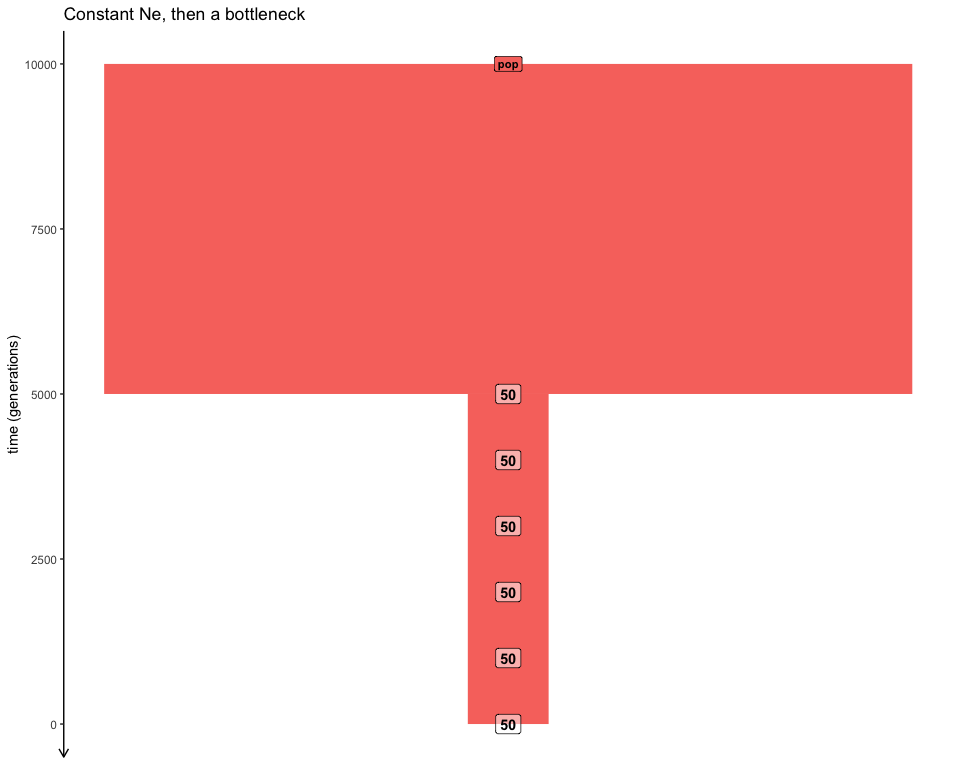
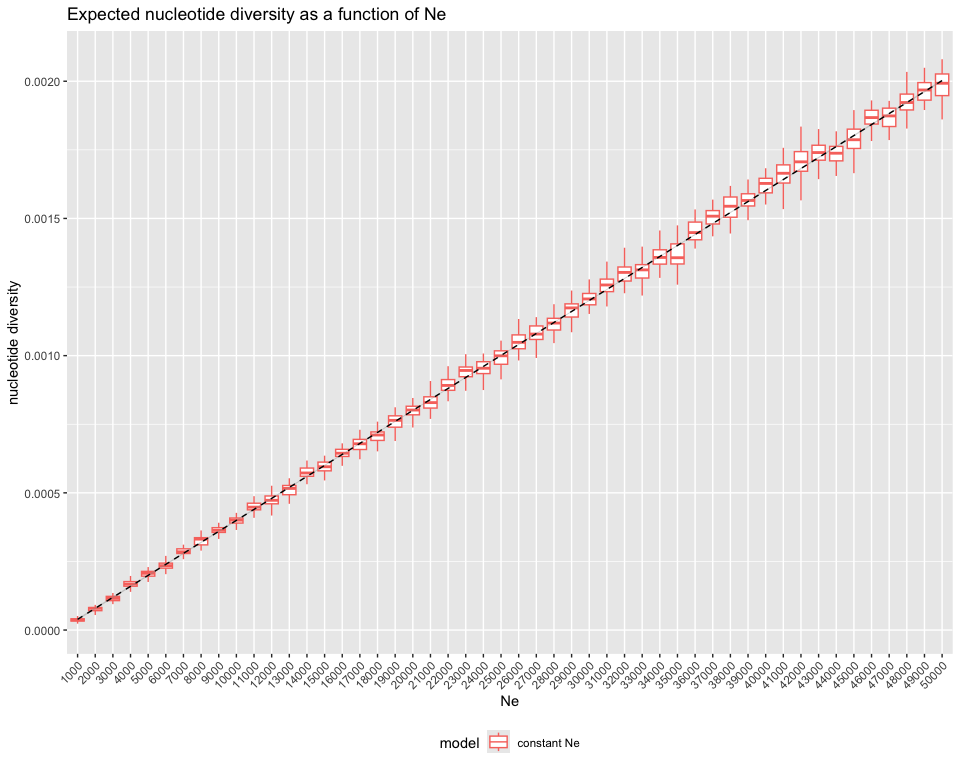
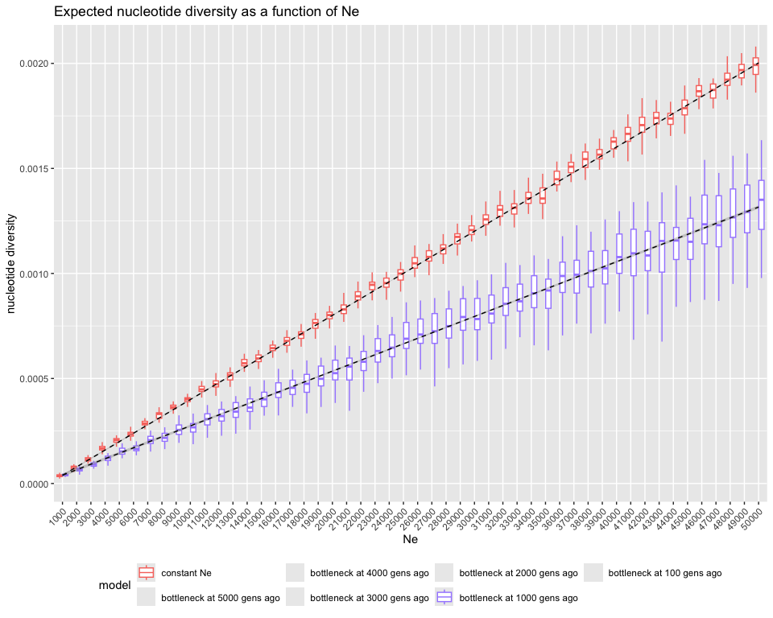
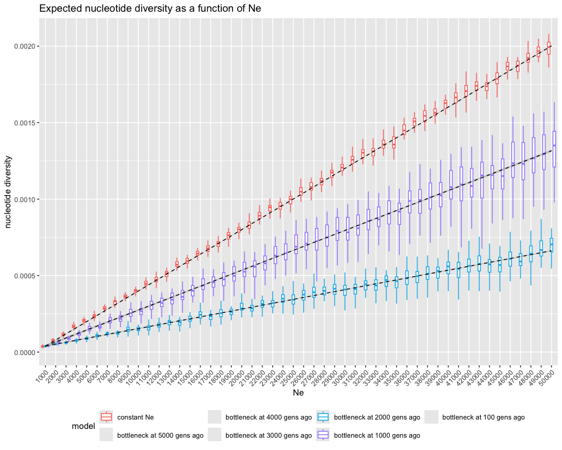
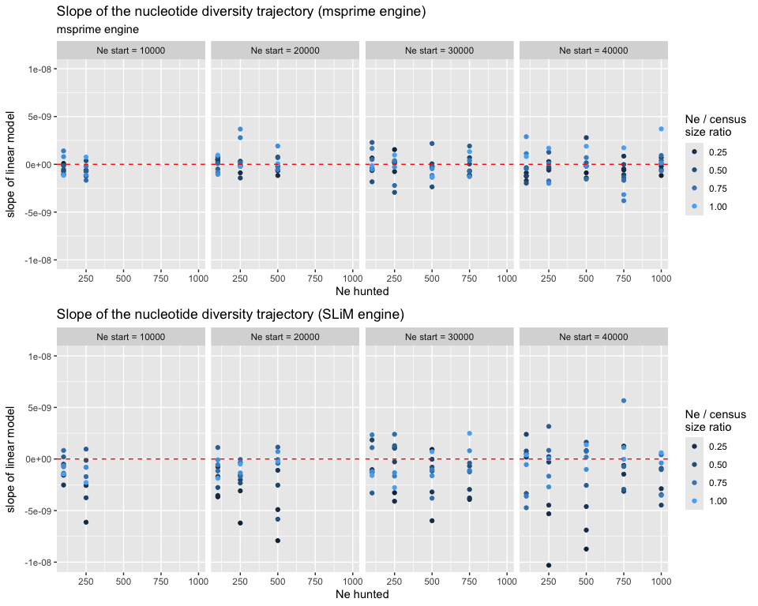
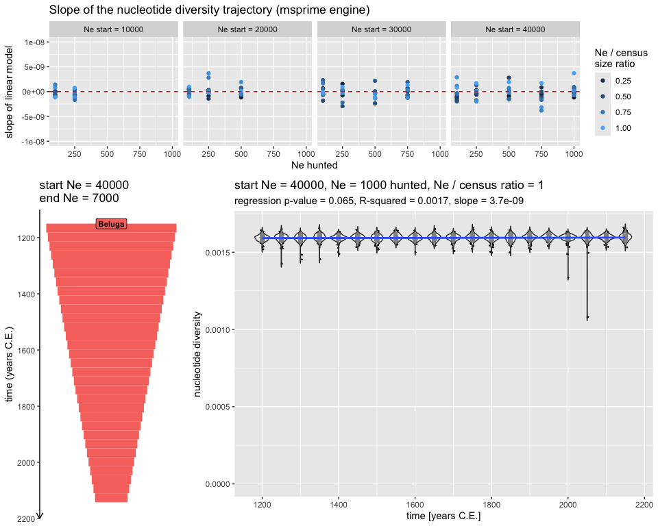

Beluga nucleotide diversity
================
2024-05-30

## Setup

Running this will make sure all dependencies of the project will be
setup before running anything else:

``` r
install.packages("renv")

renv::restore()
```

## Toy simulations of $Ne_e$ vs $\pi$

``` r
library(dplyr)
library(ggplot2)
```

<!-- -->

### Running the simulations

When run, this script will generate the file `pi_simple.rds`:

    Rscript pi_simple.R

### Results

``` r
pi_simple <- readRDS("pi_simple.rds")
```

``` r
pi_simple %>% filter(model == "constant Ne") %>%
  ggplot(aes(factor(Ne), diversity, color = model)) +
  geom_boxplot(position = position_dodge(width = 0.8), outlier.shape = NA) +
  # geom_jitter(position = position_dodge(width = 0.8), alpha = 0.2, size = 0.75) +
  geom_smooth(aes(group = model), method = "lm", linewidth = 0.5, color = "black", linetype = 2) +
  theme(axis.text.x = element_text(hjust = 1, angle = 45), legend.position = "bottom") +
  labs(x = "Ne", y = "nucleotide diversity",
       title = "Expected nucleotide diversity as a function of Ne")
```

    ## `geom_smooth()` using formula = 'y ~ x'

<!-- -->

``` r
pi_simple %>% filter(model == "constant Ne" | grepl("1000 gens", model)) %>%
  ggplot(aes(factor(Ne), diversity, color = model)) +
  geom_boxplot(position = position_dodge(width = 0.8), outlier.shape = NA) +
  # geom_jitter(position = position_dodge(width = 0.8), alpha = 0.2, size = 0.75) +
  geom_smooth(aes(group = model), method = "lm", linewidth = 0.5, color = "black", linetype = 2) +
  scale_color_discrete(drop = FALSE) +
  theme(axis.text.x = element_text(hjust = 1, angle = 45), legend.position = "bottom") +
  labs(x = "Ne", y = "nucleotide diversity",
       title = "Expected nucleotide diversity as a function of Ne")
```

    ## `geom_smooth()` using formula = 'y ~ x'

<!-- -->

``` r
pi_simple %>% filter(model == "constant Ne" | grepl("1000 gens", model) | grepl("2000 gens", model)) %>%
  ggplot(aes(factor(Ne), diversity, color = model)) +
  geom_boxplot(position = position_dodge(width = 0.8), outlier.shape = NA) +
  # geom_jitter(position = position_dodge(width = 0.8), alpha = 0.2, size = 0.75) +
  geom_smooth(aes(group = model), method = "lm", linewidth = 0.5, color = "black", linetype = 2) +
  scale_color_discrete(drop = FALSE) +
  theme(axis.text.x = element_text(hjust = 1, angle = 45), legend.position = "bottom") +
  labs(x = "Ne", y = "nucleotide diversity",
       title = "Expected nucleotide diversity as a function of Ne")
```

    ## `geom_smooth()` using formula = 'y ~ x'

<!-- -->

``` r
ggplot(pi_simple, aes(factor(Ne), diversity, color = model)) +
  geom_boxplot(position = position_dodge(width = 0.8), outlier.shape = NA) +
  # geom_jitter(position = position_dodge(width = 0.8), alpha = 0.2, size = 0.75) +
  geom_smooth(aes(group = model), method = "lm", linewidth = 0.5, color = "black", linetype = 2) +
  scale_color_discrete(drop = FALSE) +
  theme(axis.text.x = element_text(hjust = 1, angle = 45), legend.position = "bottom") +
  labs(x = "Ne", y = "nucleotide diversity",
       title = "Expected nucleotide diversity as a function of Ne")
```

    ## `geom_smooth()` using formula = 'y ~ x'

<!-- -->

## Simulations of Beluga diversity given a level of hunting

<!-- -->

``` r
library(ggplot2)
library(ggpubr)
library(dplyr)
library(tidyr)
library(cowplot)
library(slendr)
```

### Running the simulations

When run, this script will generate the file `pi_simple.rds`:

    Rscript pi_beluga.R

### Results

``` r
pi_beluga <- readRDS("pi_beluga_50Mb.rds")# %>% filter(engine == "msprime")

source("plotting.R")
```

``` r
unique(pi_beluga$Ne_start)
```

    ## [1] 10000 20000 30000 40000

``` r
unique(pi_beluga$Ne_hunted)
```

    ## [1]  100  250  500  750 1000 1500 2000 3000

``` r
unique(pi_beluga$census_ratio)
```

    ##  [1] 0.1 0.2 0.3 0.4 0.5 0.6 0.7 0.8 0.9 1.0

    > unique(pi_beluga$Ne_start)
    10000 20000 30000 40000
    > unique(pi_beluga$Ne_hunted)
    100  250  500  750 1000 1500 2000 3000
    > unique(pi_beluga$census_ratio)
    0.1 0.2 0.3 0.4 0.5 0.6 0.7 0.8 0.9 1.0

``` r
plot_grid(
  plot_slopes(pi_beluga, "msprime") + labs(subtitle = "msprime engine") + coord_cartesian(ylim = c(-1e-8, 1e-8)),
  plot_slopes(pi_beluga, "SLiM") + labs(subsubtitle ="SLiM engine") + coord_cartesian(ylim = c(-1e-8, 1e-8)),
  nrow = 2
)
```

<!-- -->

#### Starting $N_e$ = 40000, $N_e$ hunted = 100, census ratio = 1.0

``` r
plot_panels(pi_beluga, Ne_start = 40000, Ne_hunted = 100, census_ratio = 1.0, engine = "msprime")
```

<!-- -->

<!-- ```{r} -->
<!-- plot_panels(pi_beluga, Ne_start = 40000, Ne_hunted = 100, census_ratio = 1.0, engine = "SLiM") -->
<!-- ``` -->

#### Starting $N_e$ = 40000, $N_e$ hunted = 1000, census ratio = 1.0

``` r
plot_panels(pi_beluga, Ne_start = 40000, Ne_hunted = 1000, census_ratio = 1.0, engine = "msprime")
```

<!-- -->

<!-- ```{r} -->
<!-- plot_panels(pi_beluga, Ne_start = 40000, Ne_hunted = 1000, census_ratio = 1.0, engine = "SLiM") -->
<!-- ``` -->

#### Starting $N_e$ = 10000, $N_e$ hunted = 100, census ratio = 1.0

``` r
plot_panels(pi_beluga, Ne_start = 10000, Ne_hunted = 100, census_ratio = 1.0, engine = "msprime")
```

<!-- -->

<!-- ```{r} -->
<!-- plot_panels(pi_beluga, Ne_start = 10000, Ne_hunted = 100, census_ratio = 1.0, engine = "SLiM") -->
<!-- ``` -->

#### Starting $N_e$ = 10000, $N_e$ hunted = 300, census ratio = 1.0

``` r
plot_panels(pi_beluga, Ne_start = 10000, Ne_hunted = 250, census_ratio = 1.0, engine = "msprime")
```

<!-- -->

<!-- ```{r} -->
<!-- plot_panels(pi_beluga, Ne_start = 10000, Ne_hunted = 250, census_ratio = 1.0, engine = "SLiM") -->
<!-- ``` -->
